# Tarefa: IoT Security Lab - EmbarcaTech 2025

Autores: **Daltro Oliveira Vinuto e Kyara Esteves de Sousa**

Curso: Residência Tecnológica em Sistemas Embarcados

Instituição: EmbarcaTech - HBr

Brasília, Maio de 2025

---

<!-- INSIRA O CONTEÚDO DO SEU README AQUI! -->

---

## 📜 Licença
GNU GPL-3.0.  

Foi criada uma pasta chamada assets/ que contem os printscreens relacionados ao checklist das tarefa Segurança em IoT com a BitDogLab.

A **Etapa 1**(Inicializar a conexão de rede via Wi-Fi usando o SDK Pico W + lwIP
) do roteiro foi atendida com sucesso conforme podemos ver pelos printscreens abaixo: 
- Compilou sem erros:
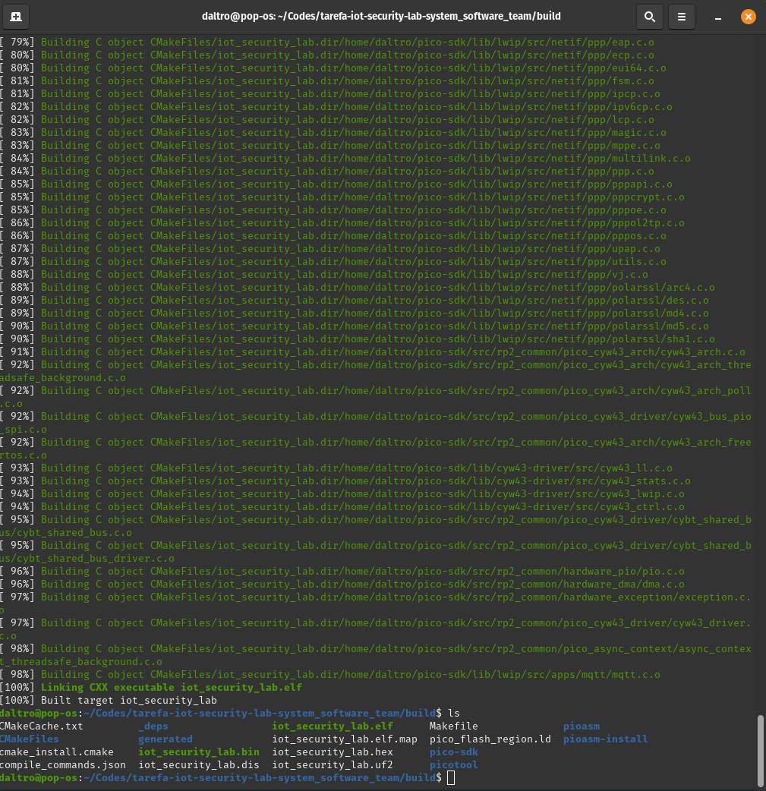  
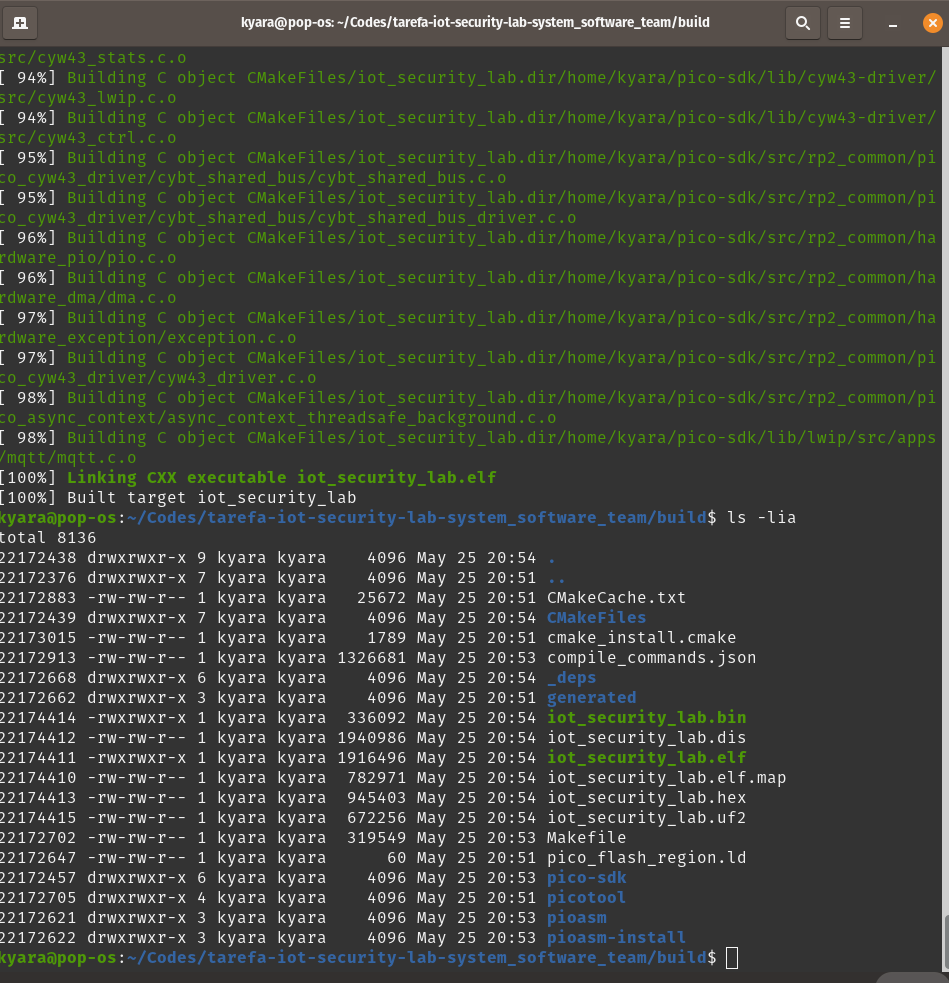  
- O teste de conexão com o wifi foi bem sucedido:   

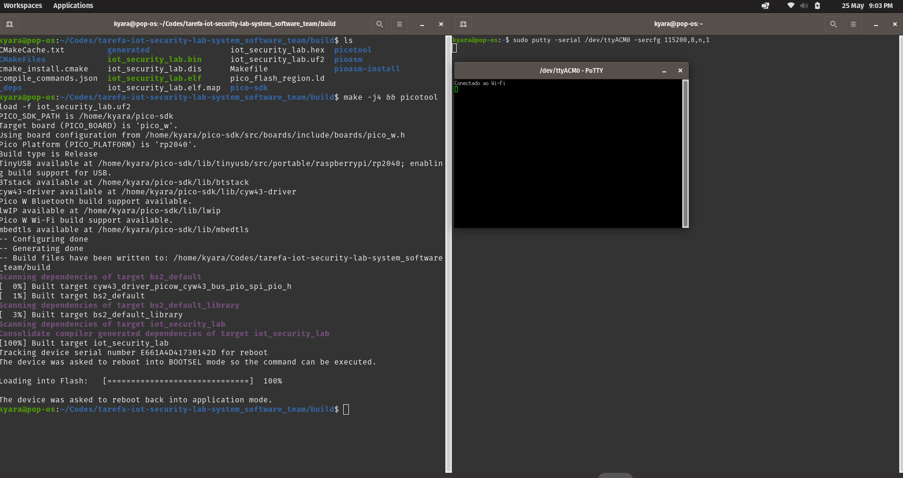)

A **Etapa 2**(Conectar um dispositivo embarcado a um broker MQTT e publicar dados em tópicos específicos, com tratamento básico de erros) do roteiro foi atendida com sucesso conforme podemos ver pelos printscreens abaixo: 
- Teste de conexão mqtt:  
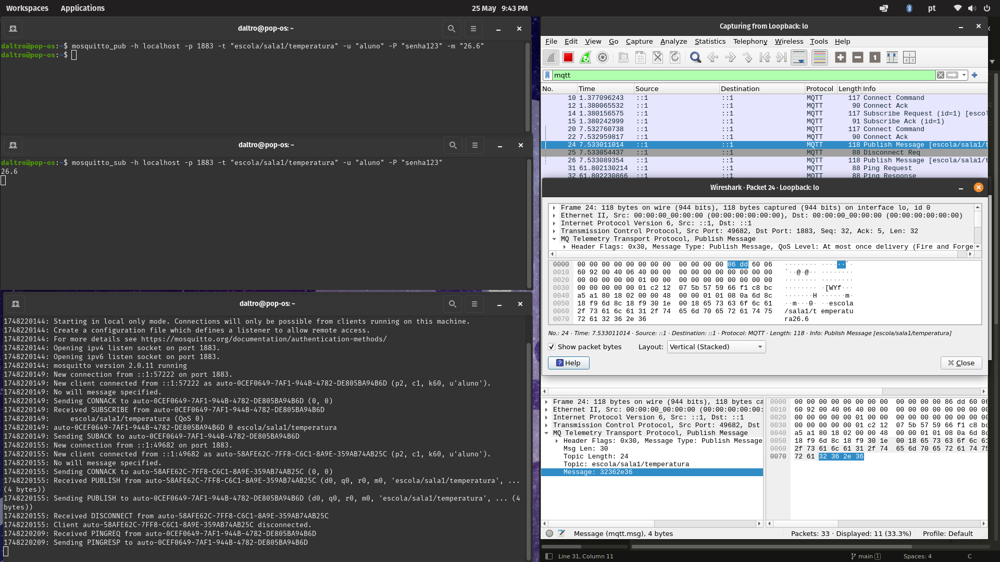
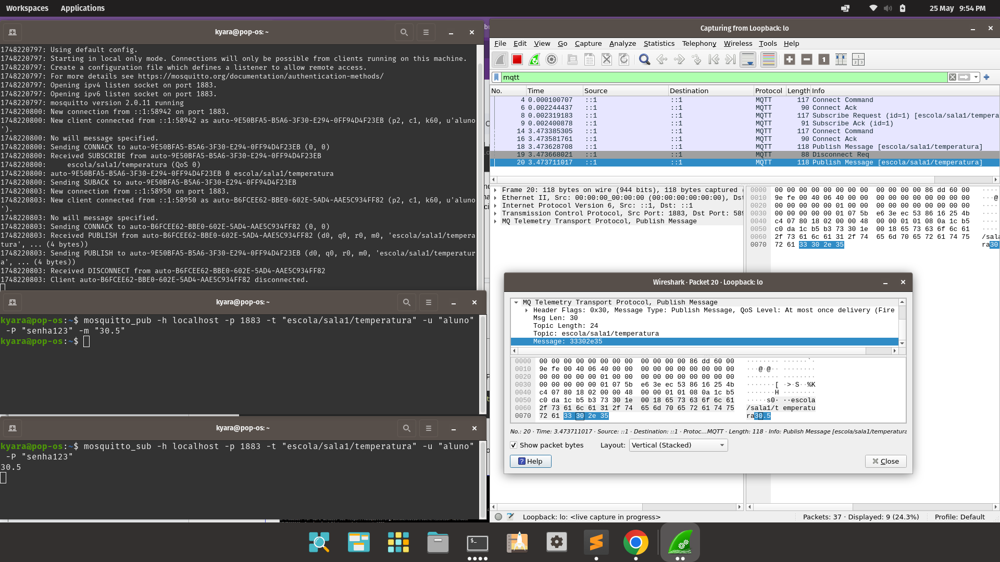

A **Etapa 3**(Enviar mensagem em texto claro via MQTT (pico-mqtt-c ou lwIP)) do roteiro foi atendida com sucesso conforme podemos ver pelos printscreens abaixo: 
 - Broker local recebe a mensagem, antes do envio (publish):   

A **Etapa 4**(Adicionar autenticação simples no broker e configurar no cliente
) do roteiro foi atendida com sucesso conforme podemos ver pelos printscreens abaixo: 
- Somente dispositivos autenticados conseguem publicar:  
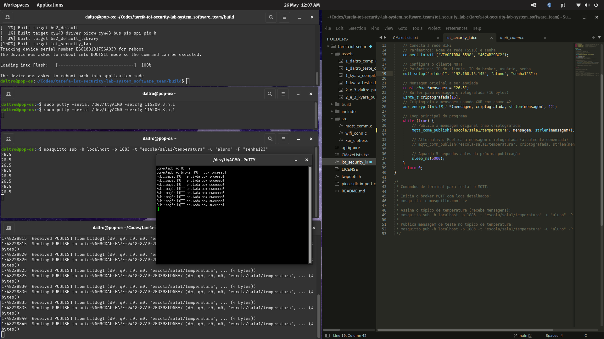
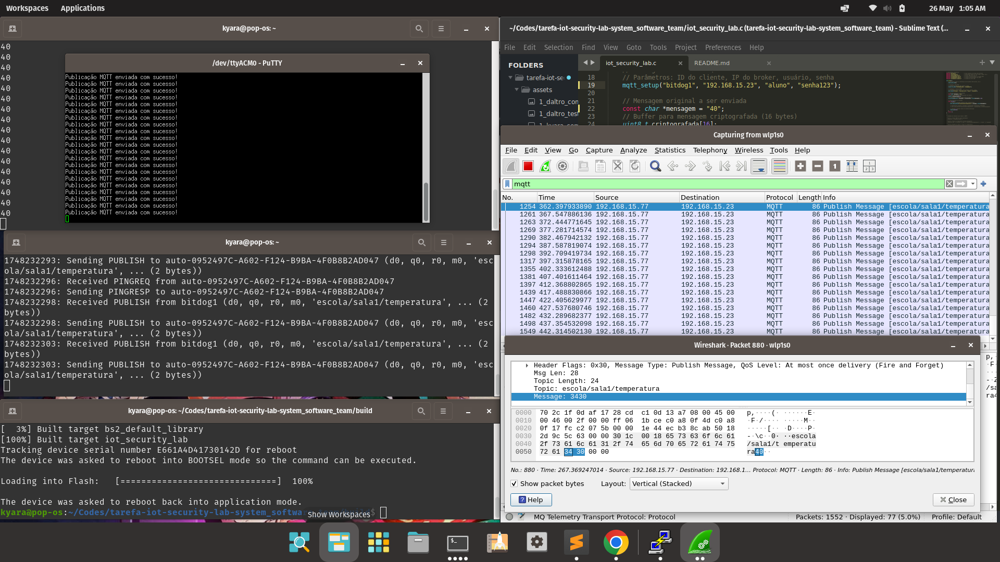

A **Etapa 5**(Ofuscar o conteúdo para evitar sniffing básico
) do roteiro foi atendida com sucesso conforme podemos ver pelos printscreens abaixo: 
- Wireshark mostra conteúdo ofuscado:
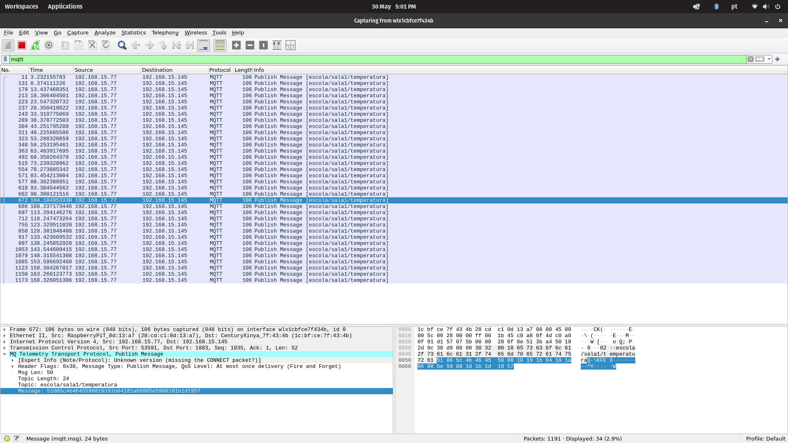  
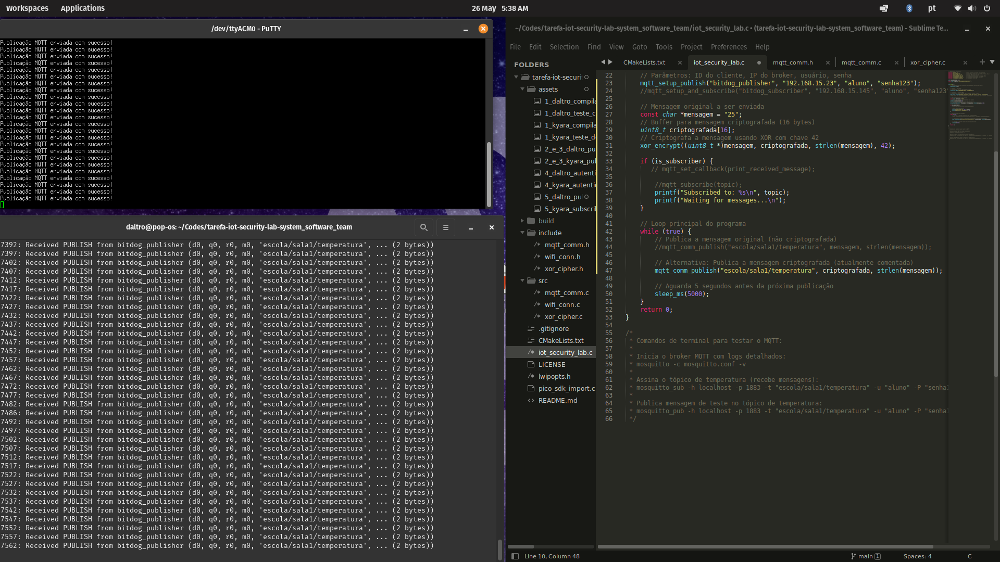

- Subscriber consegue decifrar aplicando a mesma função XOR  
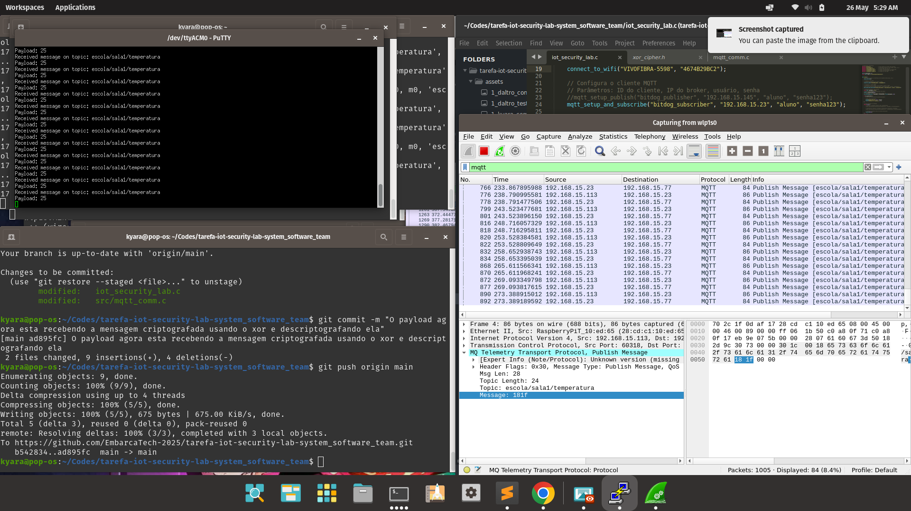

A **Etapa 6**(Adicionar timestamp e validar mensagens no subscriber) do roteiro foi atendida com sucesso conforme podemos ver pelos printscreens abaixo: 
* Mensagens antigas são descartadas e
Apenas novos timestamps são aceitos:  
  * Publisher: 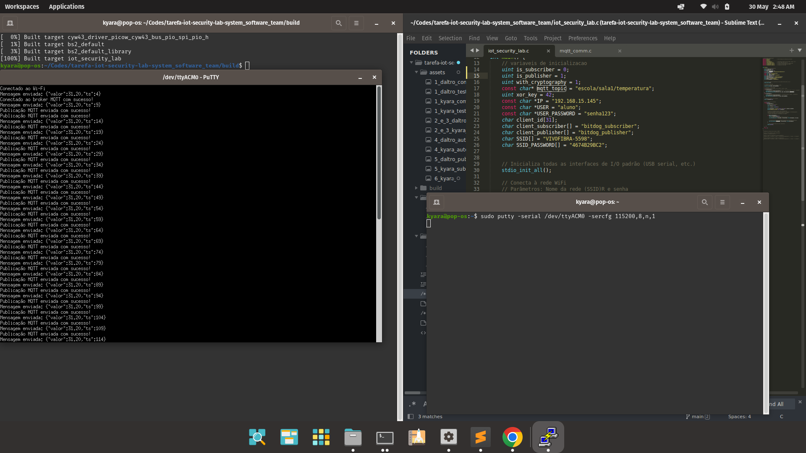
  * Subscriber: 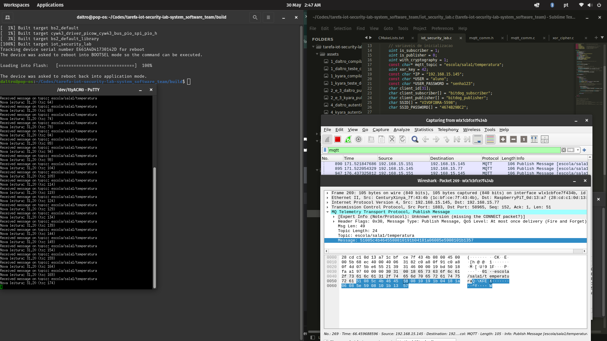
